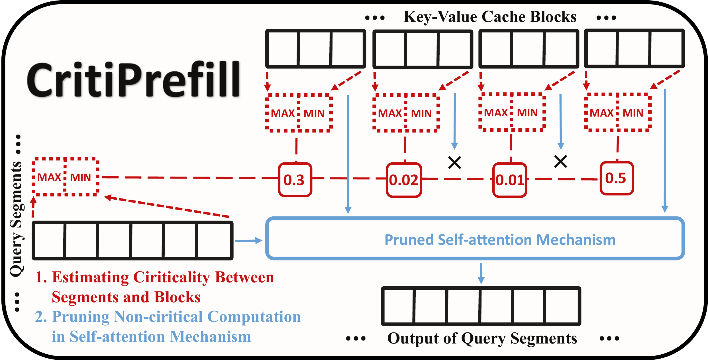
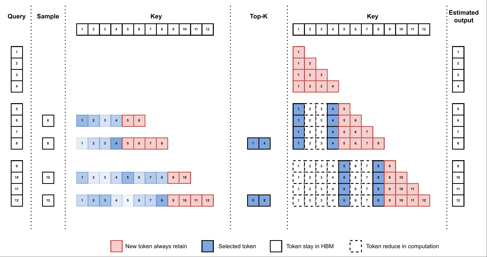
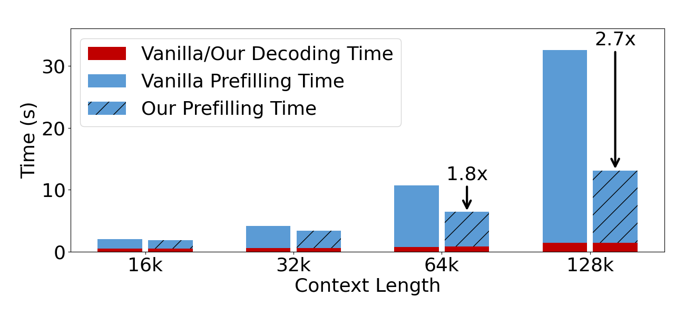

# CritiPrefill




## Quick Start

### Install

```
pip install -e . && pip install flash_attn==2.5.8 --no-build-isolation
```

### Usage

```python
from criti_prefill.modeling_patch import replace_llama_eattention, criti_config

model = LlamaForCausalLM.from_pretrained(args.model_name_or_path, 
                                             device_map=device,
                                             torch_dtype=dtype,
                                             attn_implementation="flash_attention_2"
                                             )

criti_config(model,
             segment_size=args.segment_size,
             threshold_len=args.threshold_len,
             block_size=args.block_size,
             budgets=args.budgets,
             layer_fusion=args.layer_fusion,
             layer_skip=args.layer_skip)
```

## Design

### Segment-wise Sparsity

This implementation is fully compatible with flash attention. After flash attention 2.1. the behavior of causal flag is changed: the causal mask is aligned to the bottom right corner of the attention matrix.

```
v2.0:
1 0 0 0 0
1 1 0 0 0
v2.1:
1 1 1 1 0
1 1 1 1 1
```

which make this possible:

```
   k0 k1 k2 k3 k4
q0 1  0  0  0  0
q1 1  1  0  0  0
q2 1  1  1  0  0
q3 1  1  1  1  0
q4 1  1  1  1  1

to 

segment 0 by flash attention
   k0 k1 k2 k3 k4
q0 1  0  0  0  0
q1 1  1  0  0  0

segment 1 by flash attention
   k0 k1 k2 k3 k4
q2 1  1  1  0  0
q3 1  1  1  1  0

segment 2 by flash attention
   k0 k1 k2 k3 k4
q4 1  1  1  1  1
```

To efficiently estimate the critical scores of the entire sequence, we track the maximum and minimum values of both the key blocks and query segments. By averaging across the query dimension, we synthesize the influence from all queries while taking the maximum across the key dimension to ensure that the most impactful kv cache is identified.

```
S1 = qmax @ kmax
S2 = qmax @ kmin
S3 = qmin @ kmax
S4 = qmax @ kmin

S = max(mean(S1, S3), mean(S2, S4))
```

### Information guarantee

Each segment generates an estimated output, which loss will accumulate as the layer goes deeper. If the kv cache has the same position as the query that was not selected, the information in the kv cache will be lost forever in later layers. Therefore, we always select the kv cache with the same position as the query.




### Cumulative Loss Smoothing

By observing layer similarity, we can smooth the accumulated loss between layers by employing an average-weighted mechanism to refine the final attention score. And apply layer skip to fully utilize the layer similarity.

```
score = (1 - alpha) * score + alpha * prev_score
```

## Experiments

Time to first token(TTFT) is one of the most intuitive metrics for user experience, yet it tends to be significantly slower compared to decoding time.



CritiPrefill can significantly reduce the TTFT while maintaining generation quality.


