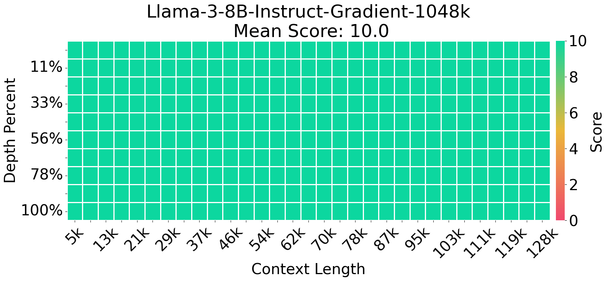
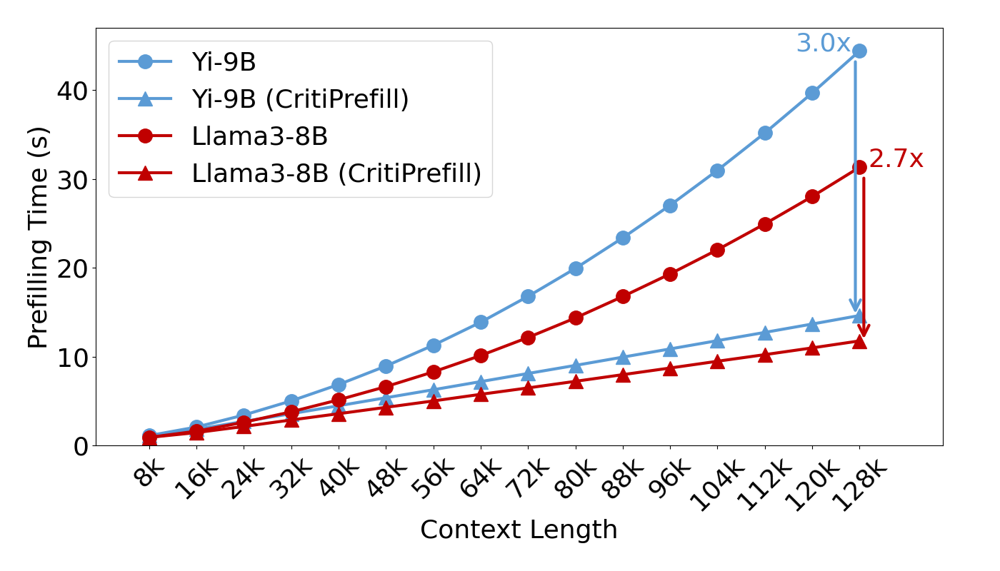

# CritiPrefill


## Quick Start

### Install

```
pip install -e . && pip install flash_attn==2.5.8 --no-build-isolation
```

### Usage

```python
from criti_prefill.modeling_patch import replace_llama_eattention, criti_config

model = LlamaForCausalLM.from_pretrained(args.model_name_or_path, 
                                             device_map=device,
                                             torch_dtype=dtype,
                                             attn_implementation="flash_attention_2"
                                             )

criti_config(model,
             segment_size=args.segment_size,
             threshold_len=args.threshold_len,
             block_size=args.block_size,
             budgets=args.budgets,
             layer_fusion=args.layer_fusion,
             layer_skip=args.layer_skip)
```

## Experiments

Time to first token(TTFT) is one of the most intuitive metrics for user experience, yet it tends to be significantly slower compared to decoding time.


CritiPrefill can significantly reduce the TTFT while maintaining generation quality.






